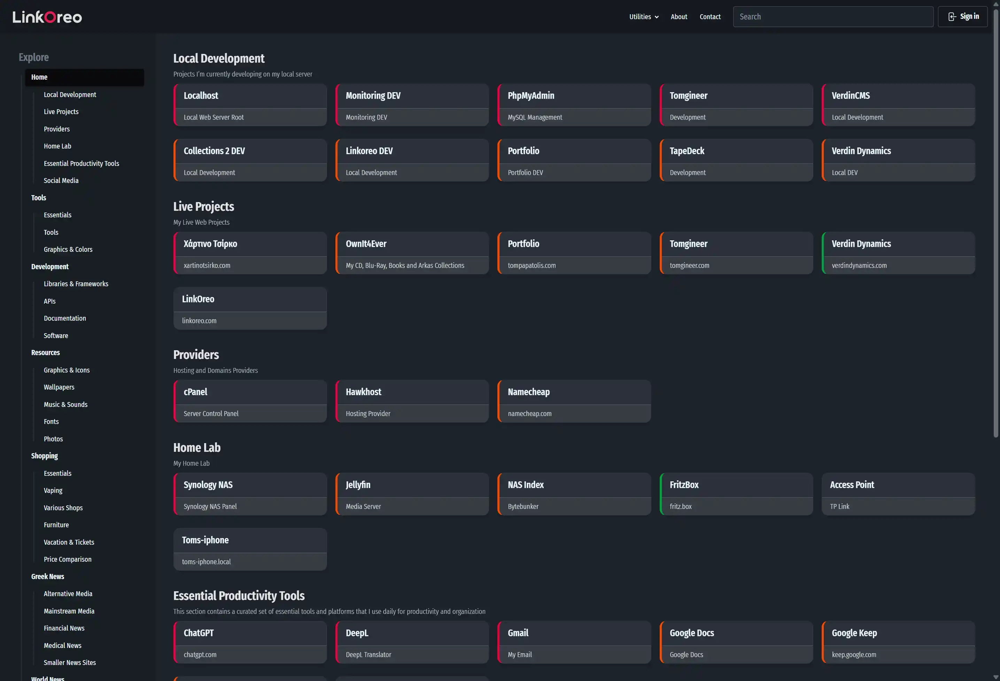

# Linkoreo

Linkoreo is a lightweight, self-hosted bookmark manager built with CodeIgniter 4, Tailwind CSS, and DaisyUI. It organizes links into tabs and sections, supports fast search, and includes an authenticated admin workflow for managing content.



## Features

- Tab and section based link organization
- Link metadata support (`label`, `url`, `description`, `importance`)
- Full-text search endpoint for links
- Admin CRUD for links, tabs, and sections
- Drag/drop-style ordering support for tabs and sections (via AJAX order updates)
- Session-based authentication
- Frontpage output caching for anonymous users
- Utility pages (password generator, hashing, datetime, worktime)

## Tech Stack

- PHP 8.2+
- CodeIgniter 4.6
- Tailwind CSS 4
- DaisyUI 5
- Esbuild

## Requirements

- PHP `^8.2`
- Composer
- Node.js + npm
- MySQL/MariaDB

## Quick Start

1. Install PHP dependencies:

```bash
composer install
```

2. Install frontend dependencies:

```bash
npm install
```

3. Create your environment file:

```bash
cp env .env
```

4. Update `.env` with:
- `app.baseURL` (for your local URL)
- Database credentials (`database.default.*`)

5. Ensure your database has the required tables:
- `users`
- `tabs`
- `sections`
- `links`
- `stats`

6. Start the app:

```bash
php spark serve
```

Open the app at the URL shown by Spark (usually `http://localhost:8080`).

## Frontend Commands

Run Tailwind + JS bundling in watch mode:

```bash
npm run dev
```

Create production assets:

```bash
npm run build
```

## Auth Routes

- `GET /sign-in`
- `POST /users/login`
- `GET /users/logout`

## Admin Routes (Authenticated)

- `GET /admin/edit_link/{id}`
- `POST /admin/update_link/{id}`
- `GET /admin/edit_tab/{id}`
- `POST /admin/update_tab/{id}`
- `GET /admin/edit_section/{id}`
- `POST /admin/update_section/{id}`
- `GET /admin/clear_cache`

## License

MIT (`LICENSE`)
